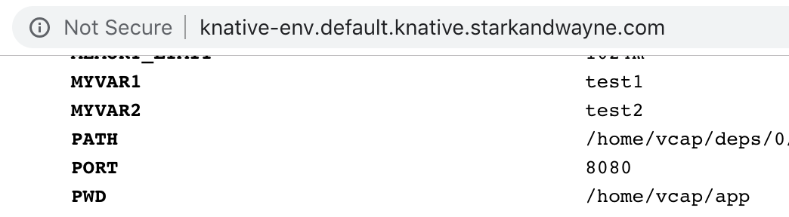

# Display Knative environment variables

A simple Sinatra application. Once deployed to Knative, it will echo the Environment and HTTP Request Headers.


## Install Knative

To install the `knctl` CLI on MacOS:

```shell
brew install starkandwayne/kubernetes/knctl
```

To install Knative, and its Istio dependency, into your current Kubernetes:

```shell
knctl install --exclude-monitoring
```

Later, you can uninstall Knative/Istio:

```shell
knctl uninstall
```

## Deploy from Docker image

The repo contains a manifest file which creates a new application called `cfenv`, with a random string in the URL to avoid collisions.

To deploy from existing Docker image:

```shell
knctl deploy -s knative-env -i index.docker.io/drnic/knative-env
```

Deploy with additional environment variables:

```shell
knctl deploy -s knative-env -i index.docker.io/drnic/knative-env \
    --env MYVAR1=test1 \
    --env MYVAR2=test2
```



## Deploy from source with Ruby buildpack

To deploy from source, whilst creating new intermediate Docker image (in Docker Hub in example below):

```shell
knctl basic-auth-secret create -s registry --docker-hub -u <you> -p <password>
knctl service-account create --service-account build -s registry

kubectl apply -f https://raw.githubusercontent.com/knative/build-templates/master/buildpack/buildpack.yaml

DOCKER_IMAGE=index.docker.io/<you>/knative-env
knctl deploy -s knative-env -i ${DOCKER_IMAGE} \
    --service-account build \
    --template buildpack \
    --directory .
```

To view in browser, either setup Ingress and DNS, or use `kwt` as below. All routes from Knative will now work from local machine:

```shell
sudo -E kwt net start --dns-map-exec='knctl dns-map'
```

By default, your application will be viewable at http://knative-env.default.example.com

## Delete

To delete the application and all its Knative artifacts (Kubernetes CRDs):

```shell
knctl service delete -s knative-env
```